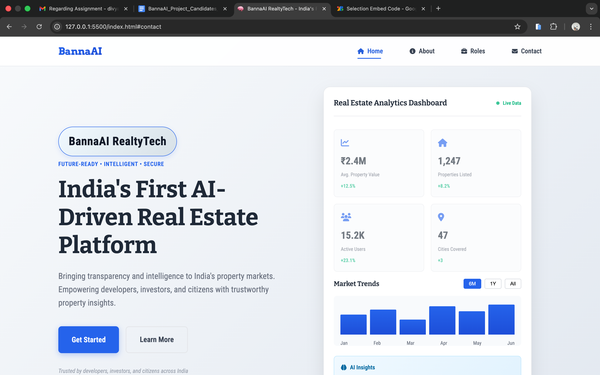

# BannaAI RealtyTech - Landing Page



## 🏠 Overview

**BannaAI RealtyTech Pvt. Ltd.** is India's First AI-Driven Real Estate Platform. This repository contains the official landing page showcasing our PropTech solutions that bring transparency, intelligence, and efficiency to India's property markets.

### 🎯 Mission

To make Indian real estate intelligent, efficient, and accessible to everyone through AI-powered analytics, geospatial data, and intelligent automation.

---

## ✨ Features

### 🎨 Modern Design
- **Minimalist UI/UX**: Clean, professional design with ample whitespace
- **Responsive Layout**: Fully optimized for mobile, tablet, and desktop
- **Smooth Animations**: Scroll-triggered animations and hover effects
- **Interactive Elements**: Expandable job cards, dynamic charts, and active navigation

### 📊 Key Sections

1. **Hero Section**: Eye-catching introduction with live data dashboard
2. **What We Do**: Core offerings and market transparency insights
3. **Open Roles**: Expandable job descriptions with multi-level projects
4. **Contact Form**: Modern contact section with validation
5. **Footer**: Comprehensive links and legal information

### 🚀 Technical Highlights

- **Pure HTML5/CSS3/JavaScript**: No frameworks, fast loading
- **Font Awesome Icons**: Professional iconography
- **Google Fonts**: Custom typography (Mulish & Outfit)
- **Active Navigation**: Section-based nav highlighting on scroll
- **Mobile-First**: Optimized for touch devices

---

## 📁 Project Structure

```
BannaAI-RealtyTech/
│
├── index.html                  # Main landing page
├── Readme.md                   # Project documentation
│
├── assets/                     # Images and media
│   └── logo.png               # Company logo
│
├── css/
│   └── styles.css             # Main stylesheet (1300+ lines)
│
├── js/
│   └── script.js              # Interactive functionality
│
└── pages/                      # Additional pages
    ├── about.html             # Detailed about page
    └── privacy-and-terms.html # Legal documentation
```

---

## 🛠️ Technologies Used

| Technology | Purpose |
|------------|---------|
| **HTML5** | Semantic structure and content |
| **CSS3** | Styling, animations, responsive design |
| **JavaScript (ES6)** | Interactivity and dynamic behavior |
| **Font Awesome 6.4** | Icon library |
| **Google Fonts** | Custom typography |

---

## 🎨 Design System

### Color Palette

```css
Primary Blue:    #2563eb
Dark Gray:       #111827
Medium Gray:     #4b5563
Light Gray:      #f8fafc
White:           #ffffff
Success Green:   #10b981
```

### Typography

- **Headings**: Outfit (700 weight)
- **Body Text**: Mulish (400-600 weight)
- **Base Font Size**: 16px
- **Line Height**: 1.6-1.8

### Responsive Breakpoints

```css
Mobile:   ≤ 480px
Tablet:   ≤ 768px
Desktop:  > 768px
```

---

## 🚀 Getting Started

### Prerequisites

- Modern web browser (Chrome, Firefox, Safari, Edge)
- Basic web server (optional, for local development)

### Installation

1. **Clone the repository**
   ```bash
   git clone https://github.com/yourusername/bannaai-realtytech.git
   cd bannaai-realtytech
   ```

2. **Open in browser**
   ```bash
   # Option 1: Direct file open
   open index.html
   

   ```


---

## 📄 Page Structure

### Main Page (index.html)

#### 1. Navigation Bar
- Sticky header with smooth scroll
- Active section highlighting
- Mobile hamburger menu
- Links: Home, About, Roles, Contact

#### 2. Hero Section
- Tagline: "Future-Ready • Intelligent • Secure"
- Primary CTA: "Get Started" → Scrolls to What We Do
- Secondary CTA: "Learn More" → Opens About page
- Live dashboard with analytics metrics

#### 3. What We Do Section
- Company introduction
- Core activities (Analytics, APIs, AI/ML)
- Market Transparency Index chart
- Purpose statement

#### 4. Open Roles Section
- Expandable job cards (Backend, ML, DevOps)
- Detailed responsibilities & requirements
- Apply buttons → Google Form
- Multi-level project descriptions
- Interview & hiring flow

#### 5. Contact Section
- Contact information with icons
- Contact form with validation
- Fields: Name, Email, Message
- Submit button

#### 6. Footer
- Company branding
- Quick links (2x2 grid on mobile)
- Resources & legal links
- Social media icons
- Copyright notice

### About Page (pages/about.html)

- Company story and vision
- Values cards (Transparency, Intelligence, Security, Sustainability)
- Benefits grid (For Developers, Investors, Citizens, Cities)
- CTA section for careers

### Privacy & Terms Page (pages/privacy-and-terms.html)

- Comprehensive privacy policy
- Terms & conditions
- Contact information
- Legal compliance

---

## 💻 Key Features Explained

### 1. Active Navigation
```javascript
// Highlights current section in navbar as user scrolls
function setActiveNav() {
    const scrollY = window.pageYOffset;
    sections.forEach(section => {
        // Calculate section position
        // Add/remove 'active' class
    });
}
```

### 2. Expandable Job Cards
```javascript
// Click to expand role descriptions
rolePills.forEach(pill => {
    pill.addEventListener('click', function() {
        // Close other pills
        // Toggle current pill
        this.classList.toggle('active');
    });
});
```

### 3. Interactive Dashboard
- Dynamic chart with period selector (6M, 1Y, All)
- Animated metric cards on scroll
- Live data indicator with pulse animation
- AI insights with confidence score

### 4. Smooth Scroll
```javascript
// Smooth scrolling for all anchor links
document.querySelectorAll('a[href^="#"]').forEach(anchor => {
    anchor.addEventListener('click', function (e) {
        e.preventDefault();
        target.scrollIntoView({ behavior: 'smooth' });
    });
});
```

---

## 📱 Responsive Design

### Mobile (≤ 480px)
- Hamburger menu navigation
- Single column layouts
- Stacked dashboard metrics (2x2)
- Full-width CTAs
- Condensed typography

### Tablet (≤ 768px)
- 2-column grid for content
- Adjusted spacing
- Optimized touch targets
- Footer in 2x2 layout

### Desktop (> 768px)
- Multi-column layouts
- Hover effects
- Larger typography
- Expanded dashboard view

---

## 🎯 Interactive Elements

### Navigation
- ✅ Active section highlighting
- ✅ Smooth scroll behavior
- ✅ Mobile hamburger menu
- ✅ Sticky header

### Animations
- ✅ Scroll-triggered fade-ins
- ✅ Hover lift effects
- ✅ Chart bar animations
- ✅ Confidence bar fill
- ✅ Pulse indicators

### Forms
- ✅ Client-side validation
- ✅ Email format checking
- ✅ Focus states
- ✅ Submit handling

---

## 🔧 Customization

### Changing Colors

Edit `css/styles.css`:
```css
/* Primary brand color */
:root {
    --primary-color: #2563eb;
    --dark-color: #111827;
    --light-color: #f8fafc;
}
```

### Updating Content

1. **Company Info**: Edit `index.html` hero section
2. **Job Roles**: Modify `.role-pill` sections
3. **Contact Details**: Update `.contact-details-grid`
4. **Footer Links**: Edit footer navigation

### Adding Sections

1. Add HTML section with unique `id`
2. Add corresponding nav link
3. Update active nav JavaScript array
4. Style in `styles.css`

---

## 📊 Performance

- **Load Time**: < 2 seconds
- **Page Size**: ~500KB (including images)
- **CSS**: ~40KB
- **JavaScript**: ~10KB
- **No external dependencies** (except fonts & icons)

---

## 🔒 Security & Privacy

- HTTPS recommended for production
- Form validation on client-side
- No sensitive data storage
- Privacy policy compliant
- GDPR considerations included

---

## 📞 Contact & Support

**Email**: contact@bannaai.com  
**Website**: www.bannaai.com  
**Location**: Mumbai, India

---

## 🤝 Contributing

This is a proprietary project for BannaAI RealtyTech Pvt. Ltd. For career opportunities, visit our [Careers Section](index.html#roles).

---

## 📜 License

© 2024 BannaAI RealtyTech Pvt. Ltd. All rights reserved.

---

## 🚀 Deployment

### GitHub Pages
```bash
git add .
git commit -m "Deploy landing page"
git push origin main
```

### Netlify
1. Connect GitHub repository
2. Build command: (none needed)
3. Publish directory: `/`

### Vercel
```bash
vercel deploy
```

---

## 📝 Changelog

### Version 1.0.0 (October 2024)
- ✅ Initial landing page design
- ✅ Responsive layout implementation
- ✅ Interactive dashboard
- ✅ Expandable job roles
- ✅ Active navigation
- ✅ About page
- ✅ Privacy & Terms page
- ✅ Mobile optimization

---

## 🎓 Future Enhancements

- [ ] Backend integration for contact form
- [ ] Analytics tracking (Google Analytics)
- [ ] Blog section
- [ ] Case studies/testimonials
- [ ] Multi-language support
- [ ] Dark mode toggle
- [ ] Advanced animations (GSAP)
- [ ] Progressive Web App (PWA)

---

## 🙏 Acknowledgments

- **Design Inspiration**: Modern PropTech leaders
- **Icons**: Font Awesome
- **Fonts**: Google Fonts
- **Development**: BannaAI RealtyTech Team

---

**Built with ❤️ by BannaAI RealtyTech**

*Transforming Indian Real Estate through AI*

