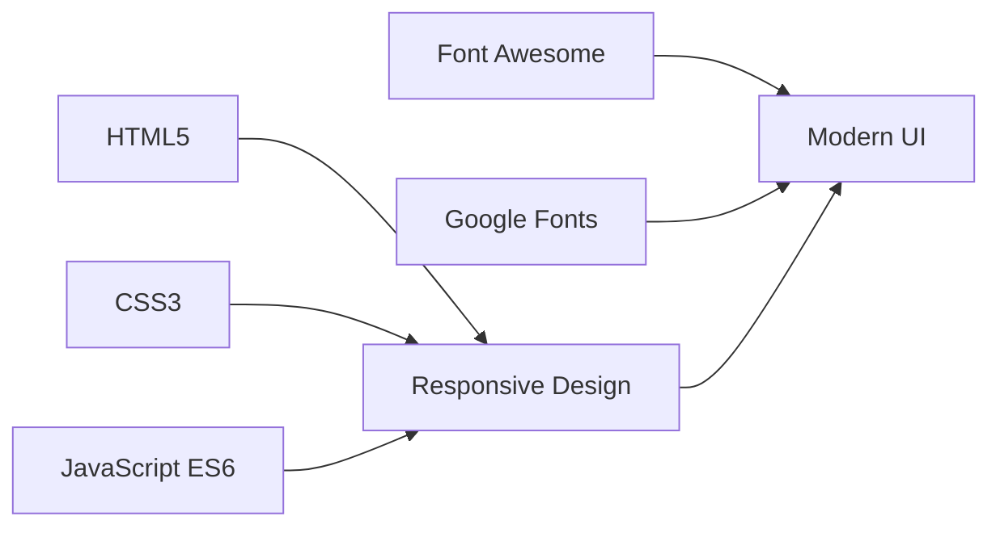

<div align="center">

# BannaAI RealtyTech

**India's First AI-Driven Real Estate Platform**

[](https://banna-ai-realty-tech.vercel.app/index.html)
[](https://github.com/divyanshsingh07/BannaAIRealtyTech.git)

---

*Bringing transparency and intelligence to India's property markets through cutting-edge AI technology.*

</div>

---

## 🎯 Mission

To make Indian real estate **intelligent**, **efficient**, and **accessible** to everyone through AI-powered analytics, geospatial data, and intelligent automation.

---

## ✨ What We Offer

| 🏠 **Analytics & Valuation** | 📊 **APIs & Dashboards** | 🤖 **AI & ML Integration** |
|:---:|:---:|:---:|
| Modular, cloud-native systems to analyze and evaluate properties | Intuitive tools for data-driven decision-making | Forecasting, GIS visualization, and tokenization frameworks |

---

## 🚀 Tech Stack



**Pure web technologies** • **No frameworks** • **Lightning fast** • **Mobile-first**

---

## 📱 Live Features

### 🎨 Interactive Dashboard
- Real-time analytics with live data indicators
- Dynamic charts with period selectors (6M, 1Y, All)
- AI insights with confidence scores
- Animated metric cards on scroll

### 💼 Career Opportunities
- **Backend Engineer** - API development, data pipelines
- **ML Engineer** - Data analysis, model training, MLOps
- **DevOps Engineer** - Terraform, CI/CD, infrastructure automation

### 📞 Smart Contact System
- Modern contact form with validation
- Direct integration with company channels
- Professional contact information display

---

## 🛠️ Quick Start

```bash
# Clone the repository
git clone https://github.com/divyanshsingh07/BannaAIRealtyTech.git

# Navigate to project
cd BannaAIRealtyTech

# Open in browser
open index.html
# or serve locally
python -m http.server 8000
```

**Visit:** [banna-ai-realty-tech.vercel.app](https://banna-ai-realty-tech.vercel.app/index.html)

---

## 📁 Project Structure

```
BannaAI-RealtyTech/
├── 📄 index.html              # Main landing page
├── 🎨 css/styles.css          # Modern styling (1300+ lines)
├── ⚡ js/script.js            # Interactive functionality
├── 🖼️ assets/                # Images and media
└── 📋 pages/                  # Additional pages
    ├── about.html            # Company details
    └── privacy-and-terms.html # Legal documentation
```

---

## 🎨 Design System

### Color Palette
```css
Primary Blue:    #2563eb  •  Dark Gray: #111827  •  Light: #f8fafc
Success Green:   #10b981  •  White: #ffffff
```

### Typography
- **Headings:** Space Grotesk (300-700)
- **Body:** DM Sans (100-1000)
- **Base Size:** 16px • **Line Height:** 1.6-1.8

### Responsive Breakpoints
- **Mobile:** ≤ 480px • **Tablet:** ≤ 768px • **Desktop:** > 768px

---

## 📊 Performance Metrics

| Metric | Value |
|:---:|:---:|
| **Load Time** | < 2 seconds |
| **Page Size** | ~500KB |
| **CSS Size** | ~40KB |
| **JavaScript** | ~10KB |
| **Dependencies** | Minimal (Fonts & Icons only) |

---

## 🔧 Key Features

### ✨ Interactive Elements
- **Active Navigation** - Highlights current section on scroll
- **Expandable Job Cards** - Click to reveal detailed descriptions
- **Smooth Scrolling** - Seamless navigation between sections
- **Mobile Hamburger Menu** - Touch-optimized navigation

### 🎭 Animations
- Scroll-triggered fade-ins
- Hover lift effects
- Chart bar animations
- Confidence bar fills
- Pulse indicators for live data

### 📝 Form Validation
- Client-side email validation
- Real-time input checking
- Professional focus states
- Submit handling with feedback

---

## 🌐 Deployment

| Platform | Status | Link |
|:---:|:---:|:---:|
| **Vercel** | ✅ Live | [banna-ai-realty-tech.vercel.app](https://banna-ai-realty-tech.vercel.app/index.html) |
| **GitHub Pages** | 🔄 Ready | [GitHub Repository](https://github.com/divyanshsingh07/BannaAIRealtyTech.git) |
| **Netlify** | 🔄 Ready | Connect GitHub repo |

---

## 📞 Contact

<div align="center">

**Ready to transform real estate? Join us in building the future of property technology.**

| 📧 Email | 📱 Phone | 📍 Location |
|:---:|:---:|:---:|
| contact@bannaai.com | +91 9106665701 | Ahmedabad, Gujarat, India |

</div>

---

<div align="center">

**Built with ❤️ by BannaAI RealtyTech**

*Ui/Ux design inspired by modern PropTech leaders • Icons by Font Awesome • Typography by Google Fonts*

---

© 2024 BannaAI RealtyTech Pvt. Ltd. All rights reserved.

</div>